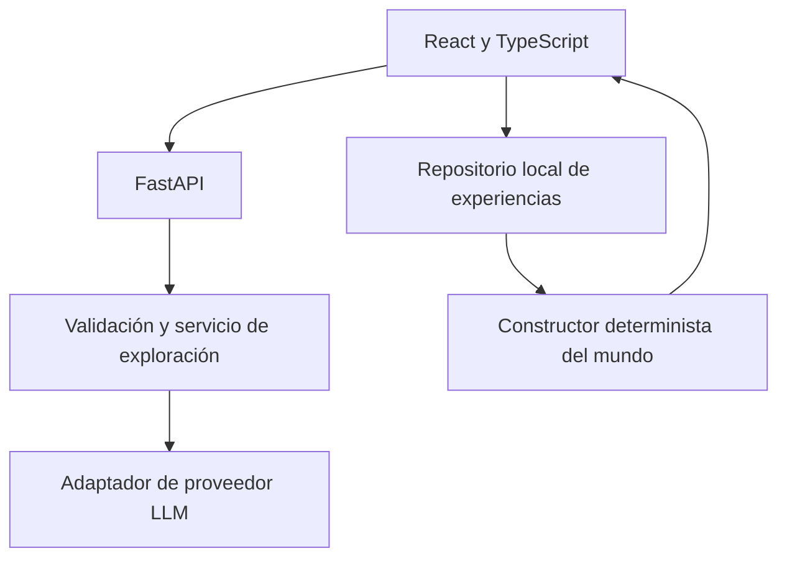

# Arquitectura y decisiones iniciales

Estado: propuesta técnica adoptada para la base del proyecto. El alcance de producto se conserva en `product/definicion-mvp.md`. Este documento puede evolucionar mediante PR con una justificación concreta.

## Sistema

Actualmente están implementados el frontend inicial, la API de salud y catálogo, y los modelos del contrato emocional. Los módulos de persistencia, exploración y construcción del mundo del diagrama son el siguiente trabajo del MVP.

## Decisiones

| Decisión                                                  | Motivo                                                                                     | Estado       |
| --------------------------------------------------------- | ------------------------------------------------------------------------------------------ | ------------ |
| Monorepo con `apps/web` y `apps/api`                      | Un solo lugar para producto, contratos y checks.                                           | Implementado |
| React + TypeScript + Vite                                 | Interfaz modular y tipado estricto con un servidor de desarrollo sencillo.                 | Implementado |
| FastAPI + Pydantic                                        | API y validación de resultados estructurados.                                              | Implementado |
| npm workspaces + uv                                       | Instalación reproducible mediante dos lockfiles.                                           | Implementado |
| Licencia MIT                                              | Elección del promotor para el proyecto open source.                                        | Implementado |
| Contratos generados desde Python                          | Evita mantener dos definiciones manuales del análisis.                                     | Implementado |
| Renderer SVG 2D con activos y posiciones permitidas       | Control de composición y continuidad; evaluar un primer prototipo antes del mapa completo. | Planificado  |
| IndexedDB detrás de `ExperienceRepository`                | Permite registros estructurados y operaciones locales transaccionales.                     | Planificado  |
| Estado de UI local; Zustand cuando haya estado compartido | Evita duplicar el historial completo en componentes y stores.                              | Planificado  |
| Adaptador LLM en servidor                                 | Cambiar proveedor sin alterar componentes o contratos de dominio.                          | Planificado  |
| Constructor del mundo por reglas                          | Resultado reproducible, eliminación coherente y sin llamada IA adicional obligatoria.      | Planificado  |

No se instalan Zustand, una biblioteca de IndexedDB ni un SDK LLM hasta que se implemente su primer uso. No se añadirá PostgreSQL para el MVP local.

## Fronteras

- Los componentes presentan datos y despachan acciones; no construyen prompts.
- El servicio de exploración valida la salida de un adaptador LLM y la contrasta con el relato.
- El adaptador no elige posiciones del mapa ni escribe experiencias.
- El repositorio local es el origen del historial confirmado.
- El mundo y los resúmenes se derivan de experiencias confirmadas, sin contar borradores.
- Los fragmentos registran procedencia y validación; una hipótesis rechazada no es un hecho.

## Versionado

La aplicación comienza en `0.1.0`; el contrato de análisis utiliza `schema_version: 1`. Estos números describen cosas distintas. Un cambio incompatible del contrato o del almacenamiento necesita una estrategia explícita de migración antes de incorporarse.

## Proveedor y despliegue

La selección de proveedor, modelo y presupuesto queda pendiente. La primera integración debe medir latencia, errores y consumo usando ejemplos ficticios. El prompt de sistema será controlado por el servidor.

No hay despliegue público configurado. El proxy de Vite solo existe en desarrollo; producción requerirá una ruta `/api` o una configuración equivalente y controles de consumo antes de exponer la IA.

## Referencias técnicas

- [Vite: inicio y build](https://vite.dev/guide/)
- [FastAPI: aplicaciones por módulos](https://fastapi.tiangolo.com/tutorial/bigger-applications/)
- [FastAPI: pruebas](https://fastapi.tiangolo.com/tutorial/testing/)
- [uv: instalación, lockfile y sincronización](https://docs.astral.sh/uv/concepts/projects/sync/)

Estas referencias explican las herramientas; las reglas emocionales y visuales son decisiones del proyecto.
